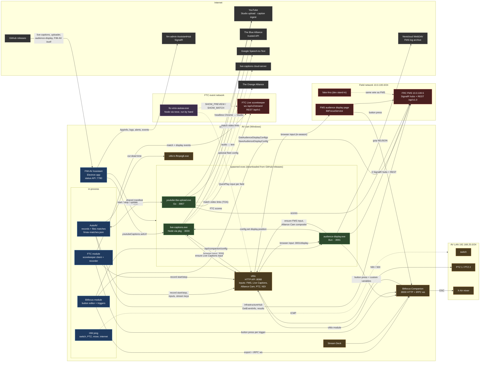

# FIM AV software map

Every program that runs on or around an FIM AV cart, and what talks to what. Drawn from the
code of each repo (fimav-assistant, audience-display v26.7, live-captions, youtube-tba-upload
v0.1.9, ftc-vmix-autoav, fake-fms, FMS 2026).

## System diagram

Solid arrows are built and in use. Dashed arrows are the older hand-run FTC tool, which
FIM-AV's FTC mode replaces.

## Components

| Component | Repo | Runtime | Ships as | Listens | Talks to |
|---|---|---|---|---|---|
| FIM-AV Assistant | FIRSTinMI/fimav-assistant | Electron 23 | NSIS installer, electron-updater from GitHub | 7780 (status API) | FMS, vMix, Companion, fim-admin, the three exes below |
| AutoAV (in FIM-AV) | same | in-process | | | FMS infrastructureHub + REST, vMix API, ffmpeg, `fimav-matches.json` |
| Bitfocus module (in FIM-AV) | same | in-process | | | Companion `/int/export/full` + `ws /trpc`, FMS audience config, custom AD config |
| live-captions | Filip-Kin/live-captions (releases FIM-AV downloads) | Node 22 via pkg | single exe, auto-update from GitHub | 3000 (overlay `/`, `settings.html`, tRPC http+ws) | Google STT, YouTube caption ingest, vMix (adds "Live Captions" input, overlay 8), optional cloud-server |
| youtube-tba-upload | Filip-Kin/youtube-tba-upload | Go | single exe, pulled by FIM-AV | 8807 | YouTube Studio (bundled Chrome), TBA trusted API, FMS results, shared manifest |
| audience-display | Filip-Kin/audience-display | Bun compiled | single exe with embedded UI, pulled by FIM-AV (own auto-update off) | 3001 (`/` operator, `/display`, `/bitfocus`, `/api/*`, `/ws`) | FMS 3 hubs + REST, vMix, Companion, live-captions position, Nextcloud log sync |
| FMS audience display page | FIRST (decompiled) | FMS web app | part of FMS | | Companion presses per BitfocusStateTypes; config stored by FMS |
| FRC FMS | FIRST | .NET | field PC | 80 (SignalR + REST) | |
| fake-fms | Filip-Kin/fake-fms | Bun | Docker at 10.0.100.5 on a test network | 80, 3010 control | stands in for FMS |
| Bitfocus Companion | Bitfocus | Electron | installed app | 8000 | vMix, X-Air, Stream Deck |
| vMix | StudioCoast | native | installed app | 8088 API, 8099 TCP | cameras, NDI, streams |
| FTC module (in FIM-AV) | same | in-process | | | FTC Live stream + REST, Companion presses, vMix recording, ffmpeg |
| ftc-vmix-autoav | FIRSTinMI/ftc-vmix-autoav | Node 14 via nexe | single exe, run by hand in a console | none | FTC Live scorekeeper ws, vMix QuickPlay |
| FTC Live scorekeeper | FIRST | Java | scorekeeping PC | 80, 28080 or 8080 (ws `/api/v2/stream/?code=`, REST `/api/v1`) | |

## FRC or FTC, in-season or off-season

The program comes from what answers: the FTC scorekeeper answering and FMS not means FTC, FMS
answering means FRC, neither keeps the last value. Settings can force either. In FTC mode only
FTC things show: Bitfocus triggers come from the scorekeeper, the vMix tab adds FTC Live's
audience display, Upload links videos on The Orange Alliance.

The season comes from the event. FRC: fim-admin's event `isOfficial`. FTC: FTC Live's event type
("Non-Advancement" and scrimmages are off-season). No answer = the stored fallback.

| | FRC in-season | FRC off-season | FTC (either season) |
|---|---|---|---|
| File names | short (`QM5_<code>.mp4`) | readable | readable or short by season |
| Audience display | FMS | FMS or custom (Settings) | FTC Live's |
| Dead-time cutting | no | optional | always (match + score reveal) |
| YouTube uploader | no | yes | yes |

A new event (a different `program:code` from FMS or the scorekeeper, whichever is active) refills
the event name and puts the FRC audience display back to FMS (`AutoAV.noteEvent`).

## FTC recording

FTC Live sends no match-end event. FIM-AV records from Match Start until that match's scores post
plus 16 s, or longer while another match still needs recording (stops 10 minutes after a match
with no post). Each match's video is cut from the raw vMix files: the match (start to start +
match length + tail) and its score reveal (post to post + 16 s). When the next match starts
before the scores post, one raw file keeps running and the late reveal is cut out of it; a post
after recording stopped records a short clip for the reveal. Raw files and the timeline live in
`<event folder>/Originals`. An aborted match keeps its footage there and gets no video of its
own: the replay is the match.

## Runtimes shipped to a cart

| Runtime | Carried by | Approx. size |
|---|---|---|
| Chromium + Node (Electron) | FIM-AV Assistant, Companion | 2 copies |
| Node 22 (pkg) | live-captions | 1 |
| Bun | audience-display | 1 |
| Node 14 (nexe) | ftc-vmix-autoav | 1 |
| none | youtube-tba-upload (Go), vMix, ffmpeg (vMix's own) | |

Each program also runs on its own outside FIM, which is why each carries its runtime.

## Open directions (not built)

- **One runtime:** stop shipping Node/Bun inside every exe when FIM-AV runs them; keep the
  standalone exes for people outside FIM.
- **Native tabs:** replace the live-captions and audience-display iframes with FIM-AV's own UI
  over their existing APIs (live-captions tRPC; audience-display `/api/*` + `/ws`).
