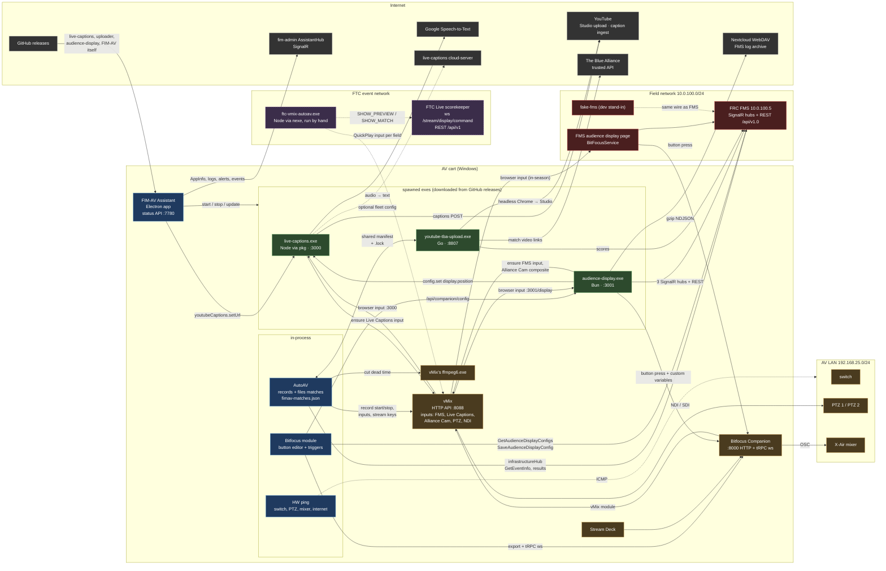

# FIM AV software map

Every program that runs on or around an FIM AV cart, and what talks to what. Drawn 2026-10-04
from the code of each repo (fimav-assistant `feat/auto-av-tab`, audience-display v26.7.1,
live-captions, youtube-tba-upload v0.1.8, ftc-vmix-autoav, fake-fms, decompiled FMS 2026).

## System diagram

Solid arrows are built and in use. Dashed arrows are FTC pieces that exist but are not part
of FIM-AV Assistant today.

## Components

| Component | Repo | Runtime | Ships as | Listens | Talks to |
|---|---|---|---|---|---|
| FIM-AV Assistant | FIRSTinMI/fimav-assistant | Electron 23 | NSIS installer, electron-updater from GitHub | 7780 (status API) | FMS, vMix, Companion, fim-admin, the three exes below |
| AutoAV (in FIM-AV) | same | in-process | | | FMS infrastructureHub + REST, vMix API, ffmpeg, `fimav-matches.json` |
| Bitfocus module (in FIM-AV) | same | in-process | | | Companion `/int/export/full` + `ws /trpc`, FMS audience config, custom AD config |
| live-captions | FIRSTinMI/live-captions | Node 22 via pkg | single exe, auto-update from GitHub | 3000 (overlay `/`, `settings.html`, tRPC http+ws) | Google STT, YouTube caption ingest, vMix (adds "Live Captions" input, overlay 8), optional cloud-server |
| youtube-tba-upload | Filip-Kin/youtube-tba-upload | Go | single exe, pulled by FIM-AV | 8807 | YouTube Studio (bundled Chrome), TBA trusted API, FMS results, shared manifest |
| audience-display | Filip-Kin/audience-display | Bun compiled | single exe with embedded UI, pulled by FIM-AV (own auto-update off) | 3001 (`/` operator, `/display`, `/bitfocus`, `/api/*`, `/ws`) | FMS 3 hubs + REST, vMix, Companion, live-captions position, Nextcloud log sync |
| FMS audience display page | FIRST (decompiled) | FMS web app | part of FMS | | Companion presses per BitfocusStateTypes; config stored by FMS |
| FRC FMS | FIRST | .NET | field PC | 80 (SignalR + REST) | |
| fake-fms | Filip-Kin/fake-fms | Bun | Docker at 10.0.100.5 (home) | 80, 3010 control | stands in for FMS |
| Bitfocus Companion | Bitfocus | Electron | installed app | 8000 | vMix, X-Air, Stream Deck |
| vMix | StudioCoast | native | installed app | 8088 API, 8099 TCP | cameras, NDI, streams |
| ftc-vmix-autoav | FIRSTinMI/ftc-vmix-autoav | Node 14 via nexe | single exe, run by hand in a console | none | FTC Live scorekeeper ws, vMix QuickPlay |
| FTC Live scorekeeper | FIRST | Java | scorekeeping PC | 80 (`/stream/display/command?code=`, `/api/v1`) | |

## Where the season is decided

FIM-AV asks FMS `GetEventInfo` every 30 s. `isOfficial` true = in-season (short file names, FMS
audience display, no uploader, no cutting). `isOfficial` false = off-season (readable file names,
custom audience display, uploader, cutting, Upload and Offseason AD tabs). No FMS answer = the
stored fallback. The Bitfocus tab's trigger source (FMS display vs custom display) is a separate
setting.

## FTC today

Nothing in FIM-AV knows FTC. The only FTC AV tool is `ftc-vmix-autoav`: an operator runs the exe
in a console, types the scorekeeper IP, event code and vMix input numbers, and it switches vMix
inputs on the scorekeeper's `SHOW_PREVIEW` / `SHOW_MATCH` websocket events. The FTC scorekeeper is
addressed by a typed `ip:port` (no fixed address like 10.0.100.5), its live stream carries only
field and timestamp (no auto/teleop/endgame phases), and match state is `UNPLAYED` / `PLAYED`.
FiM's admin backend (`FiMAdminApi`) already reads FTC results from the cloud FTC Events API, so
event metadata for FTC exists on the admin side.

## Runtimes shipped to a cart

| Runtime | Carried by | Approx. size |
|---|---|---|
| Chromium + Node (Electron) | FIM-AV Assistant, Companion | 2 copies |
| Node 22 (pkg) | live-captions | 1 |
| Bun | audience-display | 1 |
| Node 14 (nexe) | ftc-vmix-autoav | 1 |
| none | youtube-tba-upload (Go), vMix, ffmpeg (vMix's own) | |

Each program also runs on its own outside FIM, which is why each carries its runtime.

## Open directions (not built)

- **FTC in FIM-AV:** detect the event type (FMS answers at 10.0.100.5 → FRC; a scorekeeper
  answers `/stream/display/command` → FTC), then show FTC tabs and fold `ftc-vmix-autoav`'s
  switching into AutoAV instead of a hand-run console.
- **One runtime:** stop shipping Node/Bun inside every exe when FIM-AV runs them; keep the
  standalone exes for people outside FIM.
- **Native tabs:** replace the live-captions and audience-display iframes with FIM-AV's own UI
  over their existing APIs (live-captions tRPC; audience-display `/api/*` + `/ws`).
